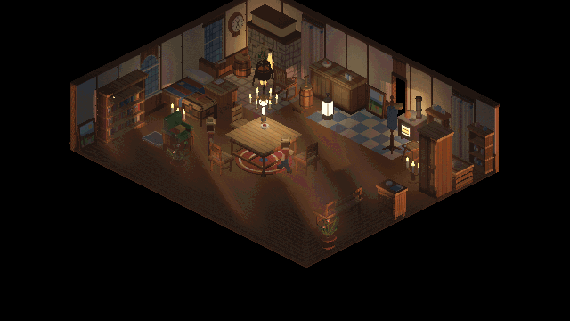
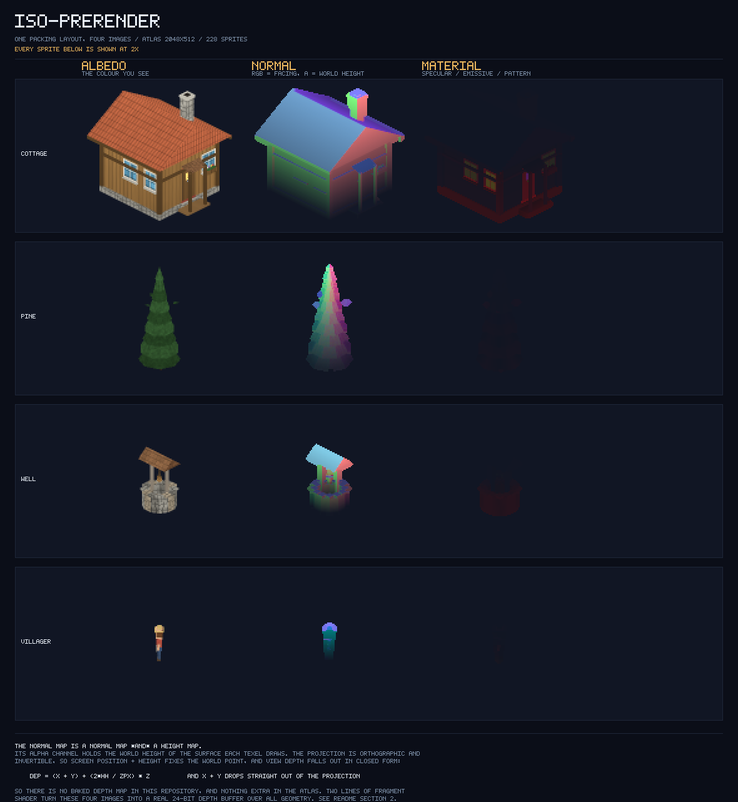
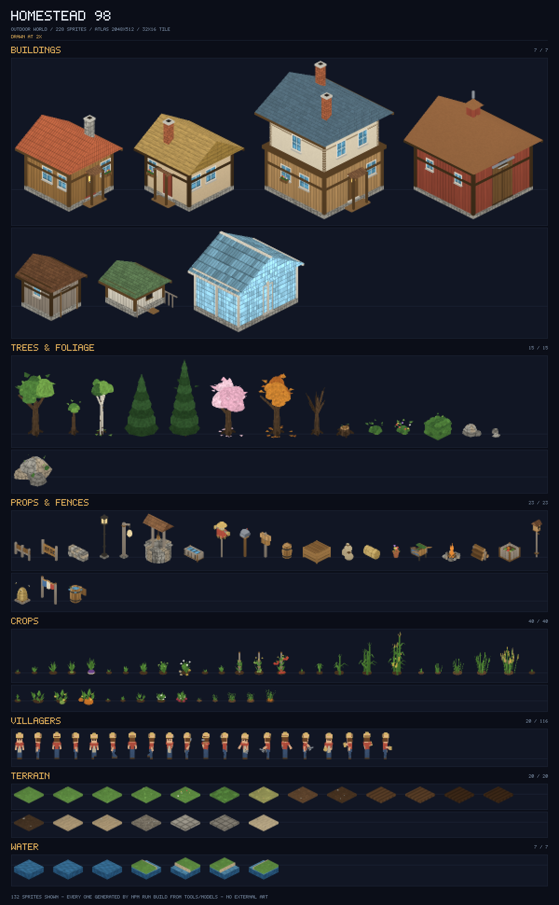
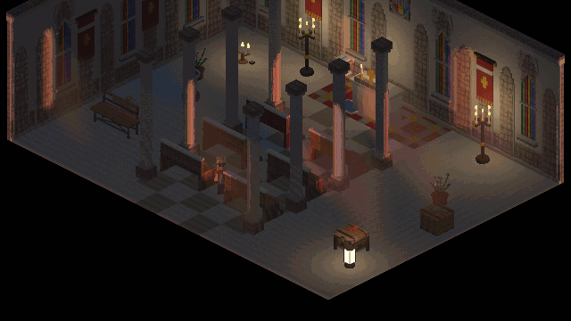

# iso-prerender

[](README.md) 

一条给 2:1 等距游戏用的预渲染管线，以及用它做出来的一个农场场景。

这个场景是**渲染切片，不是成品游戏**：没有玩法循环，也没有成长线。它的作用是端到端地压测这条管线——管线本身才是打算给别人复用的那部分。

没有 Blender、没有建模文件、没有任何第三方运行库。仓库里的每一个精灵、材质、图案、字形和着色器，都由这个仓库里的代码生成。

<p align="center">
  
</p>

<p align="center"><em>农舍里的一整天。相机一动不动——动的只有时钟。</em></p>

这条管线做的事：图集里的每个精灵除了颜色，还带一层法线和一层材质；而逐像素深度是从投影里算出来的，不是另外烘的，于是遮挡变成硬件深度测试，「谁盖住谁」不再是一个排序问题。

## 跑起来

```bash
git clone https://github.com/he1ta0/iso-prerender.git
cd iso-prerender
npm run build     # 约 7 秒，无依赖
npm run serve     # http://127.0.0.1:8123
```

`npm run single` 则产出 `dist/homestead98.html`——单个 2.99 MB 文件，所有模块和两套图集都内联在里面，不需要服务器。

跑游戏只需要一个支持 WebGL2 的浏览器。`build`、`serve`、`single` 和 `sheet` 只用 Node 内置模块，所以**全新克隆下来不跑 `npm install` 也能直接 `npm run build`**。Puppeteer 和 gifenc 是 devDependency，只给截图、验证和动图工具用。

## 管线

离线烘，运行时打光。

```
tools/models/*.mjs      模型描述就是代码——唯一的「美术源」
        │               网格、UV、逐顶点 AO、材质图案
        ▼
tools/lib/render.mjs    离线光栅化器，不用 GPU
        │
        ▼
assets/                 4 张图共享同一份打包布局
        │               albedo │ normal │ material │ stamp   (2048×512，货架打包)
        ▼
src/gl/renderer.js      一套 UV 同时寻址这四张
                        G-buffer → 光照 pass → 合成
        ▼
画面
```

一句话的核心命题：**让光比像素低频。** 精灵按硬像素烘出来——最近邻、整数对齐、有限色阶——而光照是一层连续的场，运行时乘在上面。于是轮廓仍然是脆的，光却会呼吸：太阳会走、影子会转、灯笼真的照亮它挂着的那面墙，**阳光穿过窗户落在地板上，并随时刻移动**。

## 实现要点

### 1. 深度本来就在像素里，没有烘过深度图

画家算法是把一个偏序硬压成全序：两个在屏幕上重叠、在深度上交错的精灵，不存在一个正确的绘制顺序。常见的解法是在美术之外再烘一条深度通道。

这里不需要。`normal.a` 存着每个纹素所画表面的**世界高度**，而投影是正交且可逆的，于是深度是一个闭式：

```glsl
// src/gl/shaders.js:158
float xpy = (rel.y + worldZ * u_iso.z) / u_iso.y;   // 这就是 x + y
float dep = xpy + u_depthK * worldZ + v_bias;
gl_FragDepth = clamp((dep + u_depthOrigin) / u_depthRange, 0.0, 1.0);
```

`x + y` 直接从投影里掉出来，根本不需要解出 `x` 和 `y`。两行换到一个覆盖全部几何的真正 24 位深度缓冲，**没有多花一个字节的资源**。

<p align="center">
  
</p>

<p align="center"><em>同一批精灵的三个通道。去第三列找深度图是找不到的——它就是 <code>normal.a</code>。</em></p>

### 2. 窗口透光走的是 3D-DDA，不是固定步长

固定步长穿过阴影体积，要么漏光穿墙，要么只能靠调小步长硬扛。这里是拿 3D-DDA 走过一个体素透射率体积，它跨不过遮挡物。

每扇窗都是一个密封盒子上的洞，洞的形状决定光落在哪、能扔多远（`throw = 洞高 / tan(太阳高度角)`）。彩窗的颜色来自逐体素透射率，所以五种颜色不需要任何新着色器。→ §5

### 3. 失败必须往安全的方向倒，而且要说出来

早先的版本用一张逐像素焦点图来做室内墙的幽灵化。它工作得很好——直到那张图没能生成，于是每一面被剖切的墙都静默地变回实体，把它后面的家具一起吞掉，而控制台里一个字都没有。

现在室内根本不依赖那张图，着色器有兜底分支，渲染器还会数「已经多少帧没收到焦点了」，然后点名告诉你多半在跑一份过期的模块。→ §1

## 什么可以直接复用

这不是一个库，但大部分东西也不是这个游戏专有的。

| | 文件 | 耦合程度 |
|---|---|---|
| PNG 编码器**和**解码器（索引色 + RGBA） | `tools/lib/png.mjs` | 独立，约 150 行，零依赖 |
| 货架打包器 | `tools/lib/pack.mjs` | 独立，93 行 |
| 离线光栅化器、AO 烘焙、材质图案 | `tools/lib/render.mjs` | 需要一个网格格式；AO 烘焙是通用的 |
| 从投影反解深度 | `src/gl/shaders.js` 的 `SPRITE_FS` | 需要正交等距；约 5 行 |
| 体素透射率 + DDA 室内光照 | `src/interior.js` 与 `LIGHT_FS` | 步进是通用的，体积构建是游戏形状的 |
| 位图字体 → 逐色字形图集 | `src/font.js` | 独立 |
| 单文件打包器 | `tools/build-single.mjs` | 独立 |
| 无头截图 / 动图 / 端到端验证 | `tools/*.mjs` | 经 `tools/lib/browser.mjs` 使用 puppeteer |

## 素材

全部是生成的。用 `npm run sheet` 重新产出下面这些表。

没有使用任何外部美术资源，也没有一张图是手绘的：每个精灵都是 `npm run build` 作用在 `tools/models/` 上的产物，仓库里不存在一件它自己无法重新生成的东西。

<p align="center">
  
</p>

<p align="center"><em>228 个室外精灵，2× 展示。<a href="docs/img/asset-sheet-interior.png">室内套件（313 个精灵）</a>。</em></p>

<p align="center">
  
</p>

<p align="center"><em>礼拜堂，同一天、同一机位。五扇彩窗，五条彩色光带落在地板上。</em></p>

## 仓库结构

```
src/            13 个运行时模块——场景、光照引擎、渲染器与 UI。按 ES 模块加载，没有构建步骤。
tools/models/   模型，以代码形式。建筑、礼拜堂、家具、作物、角色。
tools/lib/      离线渲染器、货架打包器、PNG 编解码器、工具共用助手。
tools/          构建、打包、验证、截图、探针、动图、资源表入口。
assets/         构建产物：2 套 × (albedo, normal, material, stamp) + manifest。
docs/img/       本文用到的图。
```

```bash
npm run build      # 离线预渲染两套 AOV 图集        -> assets/
npm run verify     # 对活着的画面跑 22 项端到端断言
npm run shot       # 无头截图，12 个时段与天气
npm run timelapse  # 上面那两张动图
npm run sheet      # 上面那两张带标签的资产表
npm run single     # 单个自包含 HTML
```

`npm run verify` 是最诚实的一个。它把游戏启动、渲染，然后**去量**：房间有没有被照亮、太阳有没有改变明暗、阳光有没有照进室内、一个被建筑挡住的村民有没有露出来**而且确实只有挡在他前面的那 1.6% 立面淡出了**、被幽灵化的墙是不是仍然挡太阳。它宁可大声失败，也不产出一张「看起来很正常」的坏构建截图。

构建是可复现的：图集 PNG 每次跑出来逐字节一致，所以你可以拿你的输出和我的对拷。`npm run build -- --stamp` 会在 manifest 里写一个构建时间，如果你想要的话。

## 关于 AI 参与

架构、技术取舍、方向指导和调试由我负责；代码与文档由 DeepSeek Harness 搭配 DeepSeek v4.1 Flash 完成。

## 许可

MIT，见 [LICENSE](LICENSE)。代码和它生成的图集一并适用。

完整的中文工程记录，走错的那几步都留在里面：**[docs/DEEP-DIVE.md](docs/DEEP-DIVE.md)**。
